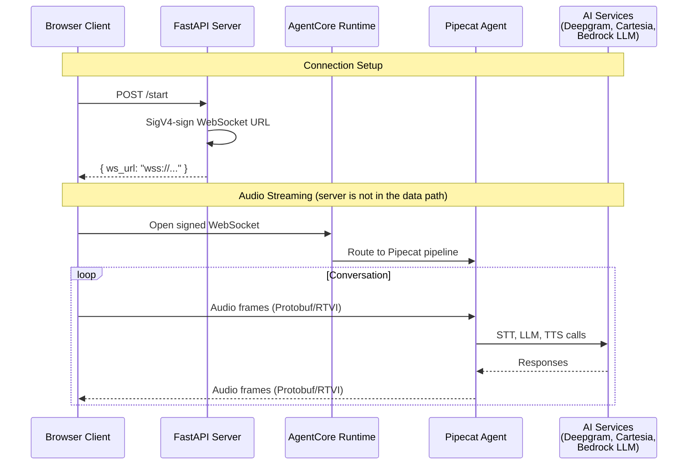

# Amazon Bedrock AgentCore Runtime WebSocket Example

This example demonstrates how to deploy a Pipecat bot to **Amazon Bedrock AgentCore Runtime** using WebSockets for communication.

> **Note:** This example focuses on illustrating how to get a Pipecat bot running as an agent in AgentCore Runtime. In the interest of staying focused on that goal, it does not address various production-readiness concerns, including but not limited to: authentication with the server that launches the agent, sanitized logging, rate limiting, CORS tightening, and input validation. Be sure to address these before deploying to production.

## Architecture



## Prerequisites

- Accounts with:
  - AWS
  - Deepgram
  - Cartesia
- Python 3.10 or higher
- `uv` package manager

## Environment Setup

### IAM Configuration

Configure your IAM user with the necessary policies for AgentCore deployment and management:

- `BedrockAgentCoreFullAccess`
- A new policy (maybe named `BedrockAgentCoreCLI`) configured [like this](https://docs.aws.amazon.com/bedrock-agentcore/latest/devguide/runtime-permissions.html#runtime-permissions-starter-toolkit)

You can also choose to specify more granular permissions; see [Amazon Bedrock AgentCore docs](https://docs.aws.amazon.com/bedrock-agentcore/latest/devguide/runtime-permissions.html) for more information.

### Environment Variable Setup

1. For agent management (configuring, deploying, etc.):

   Either export your AWS credentials and configuration as environment variables:

   ```bash
   export AWS_SECRET_ACCESS_KEY=...
   export AWS_ACCESS_KEY_ID=...
   export AWS_REGION=...
   ```

   Or use AWS CLI configuration:

   ```bash
   aws configure
   ```

2. For the agent itself:

   ```bash
   cd agent
   cp env.example .env
   ```

   Add your API keys:
   - `DEEPGRAM_API_KEY`: Your Deepgram API key
   - `CARTESIA_API_KEY`: Your Cartesia API key

3. For the server:

   ```bash
   cd server
   cp env.example .env
   ```

   Add your AWS credentials and configuration, for generating a signed WebSocket URL in the `/start` endpoint:
   - `AWS_ACCESS_KEY_ID`
   - `AWS_SECRET_ACCESS_KEY`
   - `AWS_REGION`
   - `AWS_SESSION_TOKEN` (optional — only needed for temporary credentials, e.g. AWS SSO or STS AssumeRole)

### Virtual Environment Setup

Create and activate a virtual environment for managing the agent:

```bash
uv sync
```

## Agent Configuration

Configure your Pipecat agent as an AgentCore agent:

```bash
./scripts/configure.sh
```

This script automatically:

1. Creates IAM execution role (if needed)
2. Configures container deployment with docker runtime

## ⚠️ Before Proceeding

Just in case you've previously deployed other agents to AgentCore, ensure that you have the desired agent selected as "default" in the `agentcore` tool:

```
# Check
uv run agentcore configure list
# Set
uv run agentcore configure set-default <agent-name>
```

The following steps act on `agentcore`'s default agent.

## Deploying to AgentCore

Deploy your configured agent to Amazon Bedrock AgentCore Runtime for production hosting.

```bash
./scripts/launch.sh
```

You should see commands related to tailing logs printed to the console. Copy and save them for later use.

This is also the command you need to run after you've updated your agent code.

## Running the Server

The server provides a `/start` endpoint that generates WebSocket URLs for the client to connect to the agent.

See [the server README](./server/README.md) for setup and run instructions.

## Running the Client

Once the server is running, you can run the client to connect to your AgentCore-hosted agent.

See [the client README](./client/README.md) for setup and run instructions.

## Testing Locally

To test agent logic locally before deploying to AgentCore Runtime, do the following.

First, ensure that your agent's `.env` file has AWS credentials configured (placeholders should already be there, from env.example).

Then, run the agent locally:

```bash
cd agent
uv run agent.py
```

This will make the agent reachable at "ws://localhost:8080/ws".

Then, run the server as usual, but with the `LOCAL_AGENT=1` environment variable:

```bash
LOCAL_AGENT=1 uv run server.py
```

You can then [run your client as usual](#running-the-client).

## Observation

Paste one of the log tailing commands you received when deploying your agent to AgentCore Runtime. It should look something like:

```bash
# Replace with your actual command
aws logs tail /aws/bedrock-agentcore/runtimes/foo-0uJkkT7QHC-DEFAULT --log-stream-name-prefix "2025/11/19/[runtime-logs]" --follow
```

If you don't have that command handy, no worries. Just run:

```bash
uv run agentcore status
```

## Agent Deletion

Delete your agent from AgentCore and clean up generated files:

```bash
./scripts/destroy.sh
```

## Additional Resources

For a comprehensive guide to getting started with Amazon Bedrock AgentCore, including detailed setup instructions, see the [Amazon Bedrock AgentCore Developer Guide](https://docs.aws.amazon.com/bedrock-agentcore/latest/devguide/what-is-bedrock-agentcore.html).
